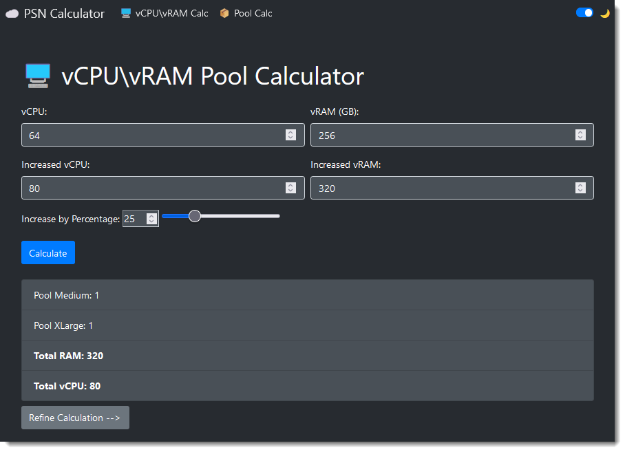
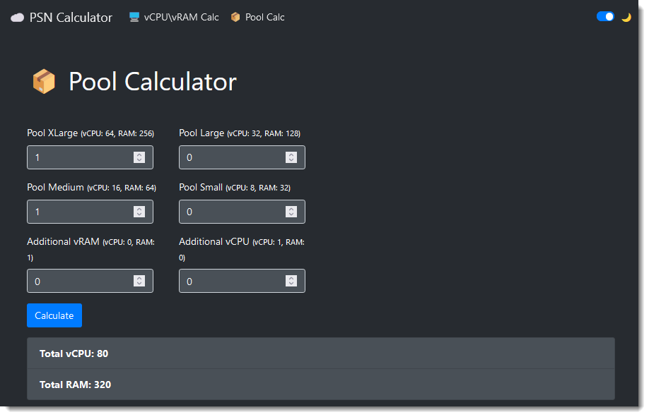

# PoolCalc ☁️ 
[](https://opensource.org/licenses/MIT) 

A small quality-of-life utility to calculate optimal resource pools utilization, written in python.


### Features:
- 🖥 vCPU\vRAM Pool Calculator (Get optimal sized pools from vCPU and vRAM) 
- 📦 Pool Calculator (Get vCPU and vRAM from number of pools) 
- 🐋 Container ready
- 🌙 Dark mode 

### How to run:
Just run the following:
```shell
git clone https://github.com/0xlnz/poolcalc && cd poolcalc
docker compose build && docker compose up 
```

### Screenshots:
vCPU\vRAM Pool Calculator  



Pool Calculator  


